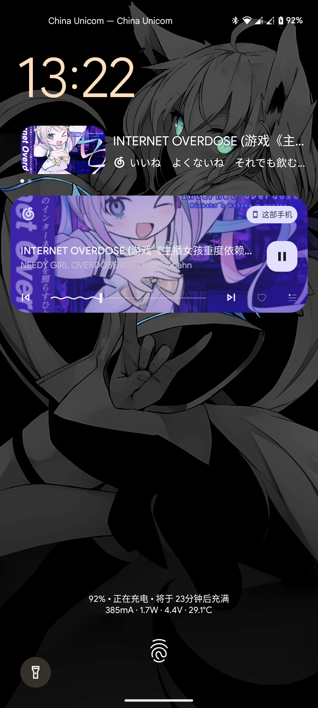

# SmartspacerLyric

可以当息屏歌词用

依赖
- [Smarspacer](https://github.com/KieronQuinn/Smartspacer)
- [Lyric-Getter](https://github.com/xiaowine/Lyric-Getter)
- `设备和应用通知`权限

## 效果

|  |  |
|----------------------|-----------------------|

## 已知问题

- 网易云音乐 播放 vip 歌曲会导致 media session 回调停止, 进而媒体信息不更新
  - callback 被无征兆移除(?)

## 感谢

[AOSP](https://source.android.com/)

[Lyric-Getter](https://github.com/xiaowine/Lyric-Getter)

[Smarspacer](https://github.com/KieronQuinn/Smartspacer)
